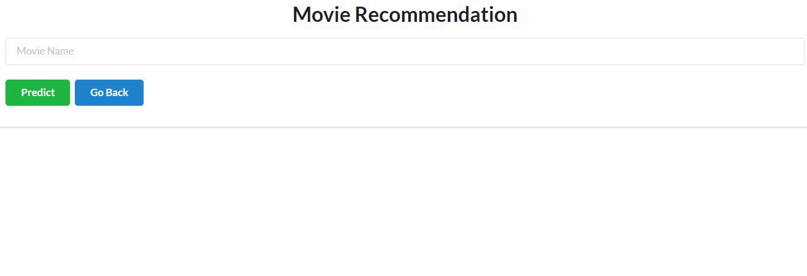
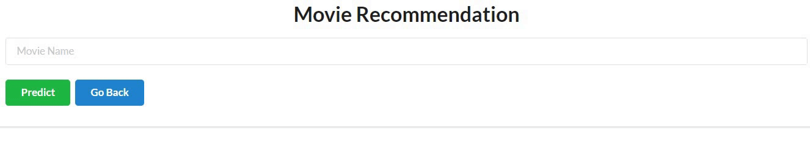

### Simple-Movie-Recommender

#### app.py
- Import `CountVectorizer()`, `cosine_similarity()` from `sklearn` and `pandas` for reading dataset.
- Read the preprocessed dataset `movies_final.csv`
- Create objects for `CountVectorizer()` and use `fit_transform()` in `data['combined']` column.
- Define a function `recommend_movie()` which takes movie name as parameter and return list of recommended movies
- Import `Flask()`, `render_template()`, `request` from `flask` and `recommend_movie()` from `recommend.py`.
- Create app object from `Flask()` and create routes `home` and `predict`
- Define a function `home()` to render the homepage of the web app 
- Define function `predict()` to get movie name input from the user by html form and predict recommend movies using `recommend_movie()` and display the output as a unordered list.

#### Prediction with Correct Movie Name 👇

#### Prediction with Wrong Movie Name 👇

